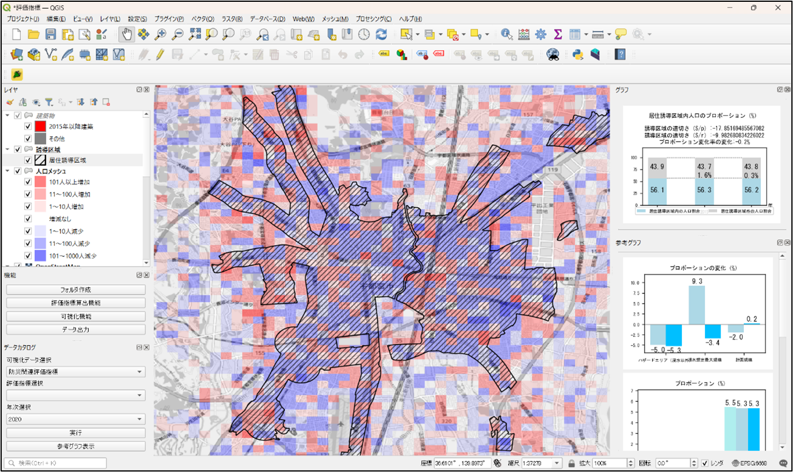

# 都市構造評価ツール

 

## 1. 概要 
本リポジトリでは、Project PLATEAUの令和6年度のユースケース開発業務の一部であるUC24-08「都市構造評価ツールの社会実装」について、その成果物である「都市構造評価ツール」のソースコードを公開しています。
「都市構造評価ツール」は、PLATEAUの3D都市モデルデータやその他のオープンデータを活用し、都市構造に係る評価指標の算出やグラフ表示、関連データの地図上での可視化を行うためのツールです。

## 2. 「都市構造評価ツール」について
「都市構造評価ツール」では、立地適正化計画の策定または改定を行うにあたり、都市構造の現状把握や課題分析、施策検討等を支援し、コンパクト・プラス・ネットワークの推進を図ることを目指しています。
本ツールでは、都市構造に関連する各種オープンデータや3D都市モデルを活用し、都市構造に係る多数の評価指標を一括算出する機能、算出された評価指標や関連データをグラフやマップで可視化する機能、および算出された評価指標を二次利用しやすいCSV形式で出力する機能を実装しています。本ツールはオープンソースのGISソフトであるQGISを使用します。\
本システムの詳細については[技術検証レポート](https://www.mlit.go.jp/plateau/file/libraries/doc/plateau_tech_doc_0103_ver01.pdf)を参照してください。

## 3. 利用手順
本システムの構築手順及び利用手順については[利用チュートリアル](https://project-plateau.github.io/Urban-structure-analysis/)を参照してください。

## 4. システム概要
### 都市構造評価ツール
#### ① フォルダ生成機能
- 収集したオープンデータを格納するためのフォルダを作成します。
- フォルダは評価指標算出に必要となるデータ単位で作成されます。

#### ② 評価指標算出機能
- 3D都市モデルの建築物モデルやその他の収集データを取り込み、所定の評価指標を算出します。
- 3D都市モデルの建築物モデルは既存プラグインPLATEAU_QGIS_Pluginを活用して取り込みます。

#### ③ 可視化機能
- 取り込まれたオープンデータや算出した評価指標を可視化します。
- インプットデータはマップ上で、評価指標はグラフ化の上それぞれ可視化します。

#### ④ データ出力機能
- 算出した評価指標や根拠データをCSV形式で出力します。

## 5. 利用技術

| 種別        | 名称                                                     | バージョン   | 内容                                   |
| --------- | ------------------------------------------------------ | ------- | ------------------------------------ |
| ミドルウェア    | [QGIS](https://qgis.org/)                              | 3.36    | 地理空間情報の表示・編集・分析が可能な地理情報システム（GIS）     |
|           | [PLATEAU QGIS Plugin](https://github.com/MIERUNE/plateau-qgis-plugin) | -       | PLATEAUデータ（CityGML形式）をQGISに取り込むプラグイン |
|           | [Links Veda](https://www.mlit.go.jp/links/)               | -       | 非構造データを構造データとして再構築するソリューション          |
| プログラミング言語 | [Python](https://www.python.org/)                      | 3.12 以降 | 汎用プログラミング言語（インプットデータの呼び出し・可視化処理に使用）  |
| ライブラリ     | [PyQGIS](https://qgis.org/pyqgis)                      | -       | QGISの機能をPythonプログラムから操作可能なAPI        |

## 6. 動作環境 <!-- 動作環境についての仕様を記載ください。 -->
| 項目 | 最小動作環境 | 推奨動作環境 |
|------|-------------|-------------|
| OS | Microsoft Windows 10 または 11 | 同左 |
| CPU | Intel Core i3以上 | 同左 |
| メモリ | 8GB以上 | 同左 |
| ディスプレイ解像度 | 1024×768以上 | 同左 |
| ネットワーク | 【3D都市モデルデータ読み込み】 各種プラグインをインストールできる環境が必要 【可視化】 オープンストリートマップを表示できる環境が必要 https://www.openstreetmap.org/#map | 同左 |

## 7. 本リポジトリのフォルダ構成 <!-- 本GitHub上のソースファイルの構成を記載ください。 -->
| フォルダ名 |　詳細 |
|-|-|
| src/algorithms | ファイル取込・データ解析 / レイヤ作成・Geopackage管理 |
| src/config | 可視化用の設定ファイルを管理|
| src/functions | 各機能の画面制御・可視化 |
| src/i18n | UIの国際化対応ファイルを管理 |
| src/models | 人口データの属性定義ファイルを管理 |
| src/utils | レイヤシンボロジの設定 |

## 8. ライセンス <!-- 変更せず、そのまま使うこと。 -->

- ソースコード及び関連ドキュメントの著作権は国土交通省に帰属します。
- 本ドキュメントは[Project PLATEAUのサイトポリシー](https://www.mlit.go.jp/plateau/site-policy/)（CCBY4.0及び公共データ利用規約第1.0版）に従い提供されています。

## 9. 注意事項 <!-- 変更せず、そのまま使うこと。 -->

- 本リポジトリは参考資料として提供しているものです。動作保証は行っていません。
- 本リポジトリについては予告なく変更又は削除をする可能性があります。
- 本リポジトリの利用により生じた損失及び損害等について、国土交通省はいかなる責任も負わないものとします。

## 10. 参考資料 <!-- 技術検証レポートのURLはアクセンチュアにて記載します。 -->
- 技術検証レポート: [https://www.mlit.go.jp/plateau/file/libraries/doc/plateau_tech_doc_0030_ver01.pdf](https://www.mlit.go.jp/plateau/file/libraries/doc/plateau_tech_doc_0103_ver01.pdf)
- PLATEAU WebサイトのUse caseページ「都市構造評価ツール」: https://www.mlit.go.jp/plateau/use-case/uc24-08/
