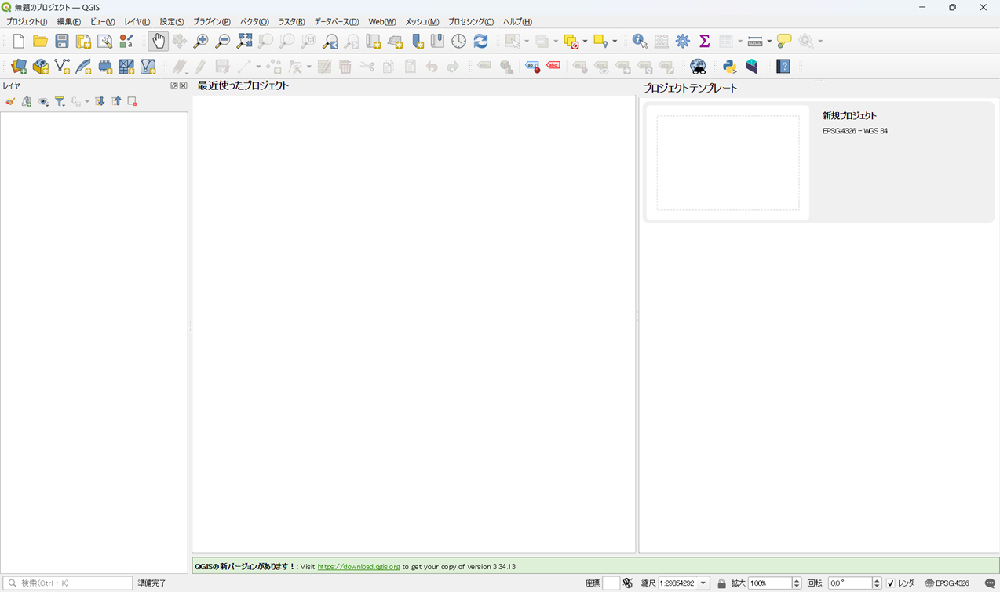
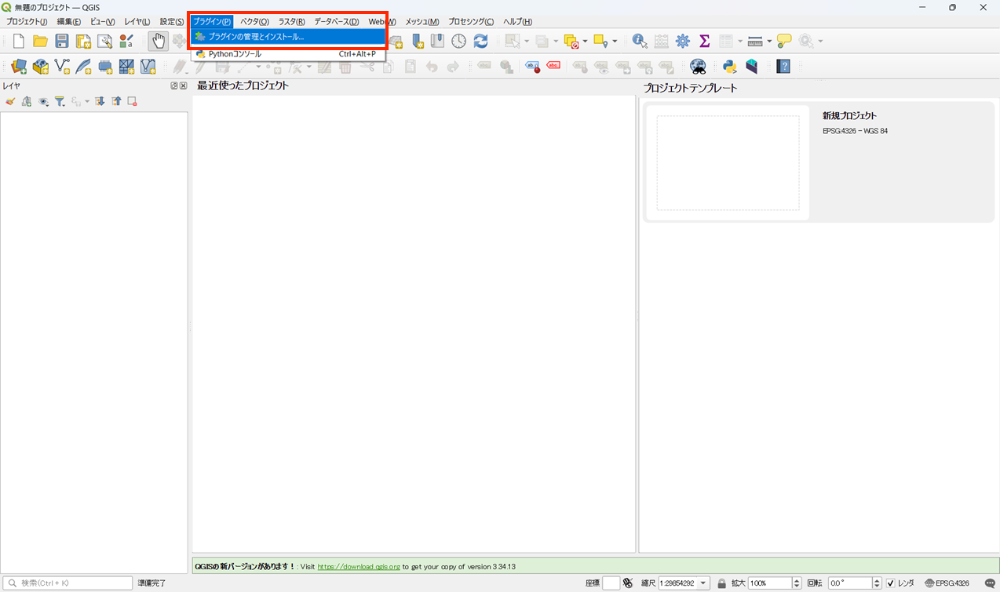
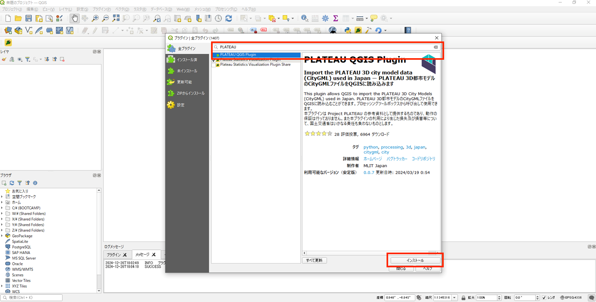
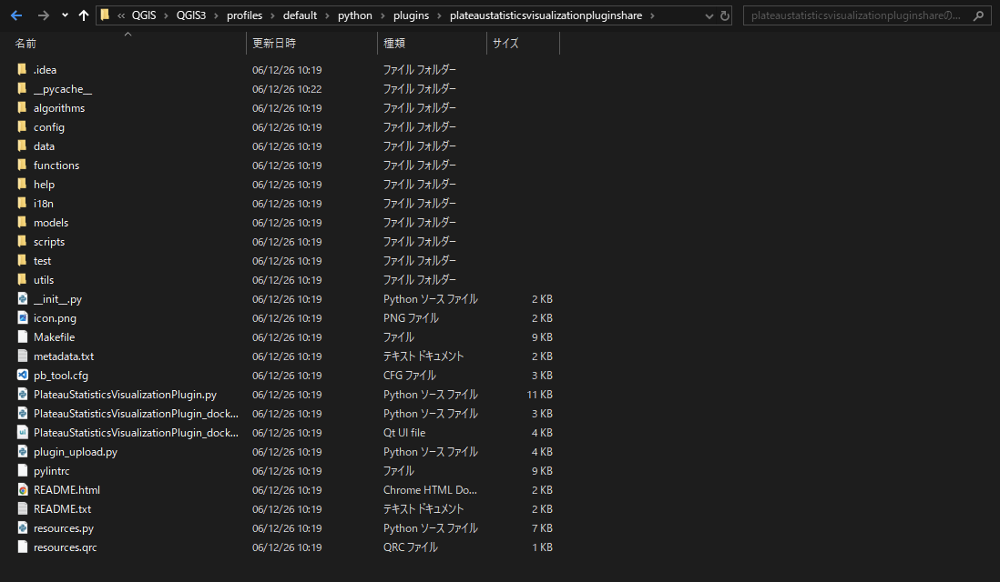

# 環境構築手順書

# 1 本書について

本書では、都市構造評価ツール（以下「本ツール」という。）の利用環境構築手順について記載しています。本ツールの構成や仕様の詳細については以下も参考にしてください。

[技術検証レポート](https://www.mlit.go.jp/plateau/file/libraries/doc/plateau_tech_doc_0030_ver01.pdf)

# 2 動作環境

本システムの動作環境は以下のとおりです。

| 項目 | 最小動作環境 | 推奨動作環境 | 
| - | - | - | 
| OS | Microsoft Windows 10 または 11 | 同左 | 
| CPU | Intel Core i3以上 | 同左 | 
| メモリ | 8GB以上 | 同左 | 
| ディスプレイ解像度 | 1024×768以上 |  同左  | 
| ネットワーク       | 【【3D都市モデルデータ読み込み】 各種プラグインをインストールできる環境が必要 【可視化】 オープンストリートマップを表示できる環境が必要 https://www.openstreetmap.org/#map |  同左                            | 

# 3 インストール手順
## 1. QGISのインストール
[こちら](https://qgis.org/download/)
からQGISをダウンロード、インストールします。

## 2. PLATEAU QGIS Plugin プラグインのインストール
QGISのインストール後下記の手順を行ってください。
#### 2-1. QGISを起動します。

#### 2-2. メニューのプラグイン>プラグインの管理とインストールを開きます。

#### 2-3. 検索バーにて「PLATEAU」で検索しPLATEAU QGIS Pluginをインストールします。 

## 3. 本ツールプラグインインストール
#### 3-1. プラグインのダウンロード
[こちら](https://github.com/Project-PLATEAU/Urban-structure-analysis/)
から本ツールのソースコードをダウンロード可能です。

QGISのインストール後、ダウンロードしたソースコードのsrcフォルダの名前を変更し、
C:\Users\{UserName}\AppData\Roaming\QGIS\QGIS3\profiles\default\python\plugins
配下に配置します。

# 4 準備物一覧

アプリケーションを利用するために以下のデータを入手します。

| | データ種別 | 機能                                                                                                                        | 用途                 | 入力方法           |
| ---------- | --------------------------------------------------------------------------------------------------------------------------- | -------------------- | ------------------ | ------------------------------------------------ |
| ①          | 【IF001】3D都市モデル(CityGML)G空間情報センターから取得します。  https://front.geospatial.jp/                                         | 評価指標算出機能                 | 全般               | 格納フォルダパス指定                             |
| ②          | 【IF002】ゾーンポリゴン 小地域（基本単位区 JGD2011）境界データをe-stat から取得します。  https://www.e-stat.go.jp/gis        | 評価指標算出機能 | 全般       | 格納フォルダパス指定          |
| ③          | 【IF003】鉄道駅位置  鉄道駅位置（ライン）データを国土数値情報から取得します。  https://nlftp.mlit.go.jp/ksj | 評価指標算出機能 | 全般       | 格納フォルダパス指定      |
| ④          | 【IF004】道路ネットワーク  OpenStreetMapデータをgeofabrikから取得します。   https://download.geofabrik.de/asia/japan.html  | 評価指標算出機能 | 全般       | 格納フォルダパス指定          |
| ⑤          | 【IF005】施設ポイントデータ  各施設（ポイント）データを国土数値情報から取得します。(医療施設、学校、行政施設、福祉施設、文化施設)  https://nlftp.mlit.go.jp/ksj                                       | 評価指標算出機能 | 全般       | 格納フォルダパス指定                             |
| ⑥          | 【IF006】 避難施設情報  避難施設（ポイント）データを国土数値情報から取得します。  https://nlftp.mlit.go.jp/ksj      | 評価指標算出機能 | 全般 | 格納フォルダパス指定
| ⑦          | 【IF007】 鉄道ネットワーク  鉄道（ライン）データを国土数値情報から取得します。  https://nlftp.mlit.go.jp/ksj      | 評価指標算出機能   | 全般 | 格納フォルダパス指定 |
| ⑧          | 【IF008】 バス停位置  GTFS JP 形式で作成されたデータ | 評価指標算出機能   | 全般 | 格納フォルダパス指定 |
| ⑨          | 【IF009】 バスネットワーク  GTFS JP 形式で作成されたデータ | 評価指標算出機能   | 全般 | 格納フォルダパス指定 |
| ⑩          | 【IF010】 国勢調査メッシュ別データ  e-statから取得します。  https://www.e-stat.go.jp/gis | 評価指標算出機能   | 全般 | 格納フォルダパス指定 |
| ⑪          | 【IF011】 メッシュ別将来推計人口データ  500mメッシュの将来推計人口データを国土数値情報から取得します。  https://nlftp.mlit.go.jp/ksj  | 評価指標算出機能   | 全般 | 格納フォルダパス指定 |
| ⑫          | 【IF012】250mメッシュポリゴンデータ  250mメッシュ境界データをe-statから取得します。  https://www.e-stat.go.jp/gis  | 評価指標算出機能   | 全般 | 格納フォルダパス指定 |
| ⑬          | 【IF013】ハザードエリア  洪水浸水想定区域（1次メッシュ単位）データ、高潮浸水想定区域（ポリゴン）データ、津波浸水想定（ポリゴン）データ、土砂災害警戒区域（ポリゴン）（ライン）データを国土数値情報から取得します。  https://nlftp.mlit.go.jp/ksj  | 評価指標算出機能   | 全般 | 格納フォルダパス指定 |
| ⑭          | 【IF014, IF015, IF019, IF020】都市機能誘導区域,居住誘導区域, 都市計画区域, 用途地域   立地適正化計画区域（xxxxx_ritteki.shp）、都市計画区域（xxxxx_tokei.shp）、用途地域（xxxxx_youto.shp）データを都市計画決定GISオープンデータから取得します。  https://www.mlit.go.jp/toshi/tosiko/toshi_tosiko_tk_000087.html  | 評価指標算出機能   | 全般 | 格納フォルダパス指定 |
| ⑮         | 【IF016】交通流動  交通流動量 パーソントリップ発生・集中量データを国土数値情報から取得します。  https://nlftp.mlit.go.jp/ksj  | 評価指標算出機能   | 全般 | 格納フォルダパス指定 |
| ⑯         | 【IF017】地価公示  地価公示（ポイント） データを国土数値情報から取得します。  https://nlftp.mlit.go.jp/ksj  | 評価指標算出機能   | 全般 | 格納フォルダパス指定 |
| ⑰         | 【IF019】空き家  空き家ポイントデータ（シェープファイル）を作成します。  | 評価指標算出機能   | 全般 | 格納フォルダパス指定 |
