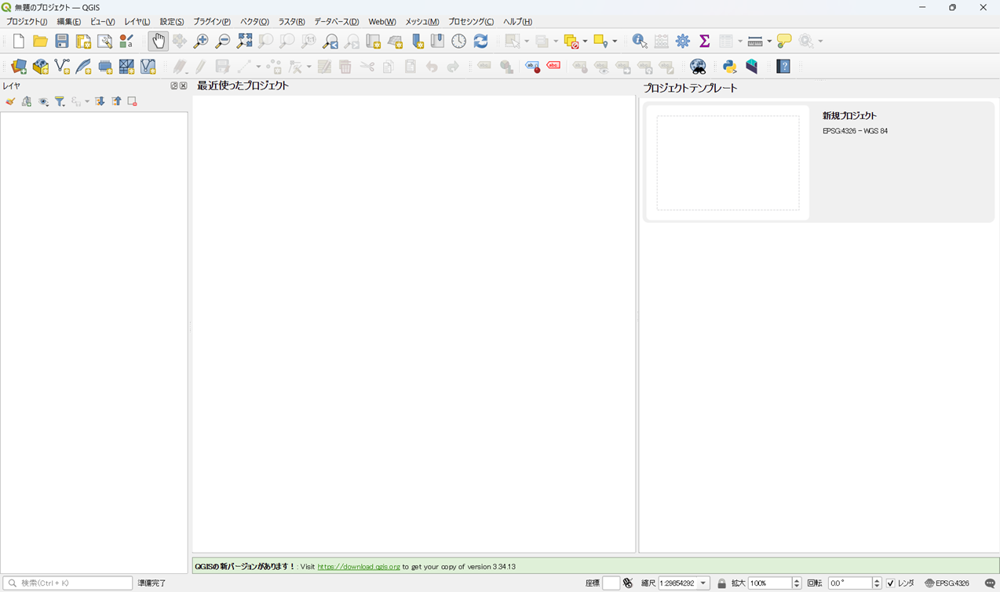

# 操作マニュアル

# 1 本書について

本書では、都市構造評価ツール（以下「本ツール」という。）の操作手順について記載しています。

# 2 使い方

## 2-1 3D都市モデル（建物データ）の取り込み

QGISを起動します。

PLATEAU QGIS Pluginを起動します。
※PLATEAU QGIS Plugin プラグインのインストール方法については、環境構築手順書を参照ください。

「バッチプロセスで実行」を押下し、バッチ処理画面を開きます。

PLATEAU CityGMLファイル>ファイル選択をクリックし、取り込みを行う建物データを選択します。
CityGMLデータフォルダの「bldg」フォルダ内のGMLファイルを選択してください。

ファイル選択後、「実行」ボタンを押下し建物データの取り込みを行います。

取り込みが完了するとマップ上に建物データが表示されます。

## 2-2 本ツールの起動
※本ツール プラグインのインストール方法については、環境構築手順書を参照ください。
プラグイン>Plateau Statics Visualization Pluginを選択しプラグインを起動します。

## 2-3 フォルダ生成・データ格納
本ツール 機能パネル内【フォルダ作成】を押下し、インプットデータの格納フォルダを作成します。

作成されたフォルダにインプットデータを格納します。

## 2-4 評価指標算出
本ツールプラグインの機能パネル内【評価指標算出機能】を押下し、インプットデータ、アウトプットデータの格納フォルダ、および圏域設定を指定して評価指標算出を行う。圏域設定は鉄道やバス停、避難所の各データから半径何ｍの範囲を対象とするか数値で入力を行う。

インプットデータの取り込み、指標の算出処理が実行されます。

算出完了

## 2-5 可視化

評価指標の算出後、本ツールプラグインの機能パネル内【評価指標算出機能】を押下し評価指標の可視化を行う。

可視化データを選択します。

評価指標を選択します。

年次を選択します。

実行ボタンを押下すると、選択した指標に該当するレイヤの凡例、マップ、グラフが表示されます。

評価指標を選択し、参考グラフ表示ボタンを押下すると選択した指標の参考グラフが表示されます。

## 2-5 データ出力
本ツールプラグインの機能パネル内【データ出力】を押下しデータ格納先フォルダおよび出力形式を指定する。

OKボタンを押下すると評価指標算出機能で算出した各指標に基づくデータを出力することができます。
